# NEC Decoder

Dekodiert NEC-Infrarot-Fernbedienungssignale. Empfängt Puls-Messungen vom `ir_pulse_timer` und gibt Address, Command und Status-Signale aus.

## Blockdiagramm



## Schnittstelle

### Inputs (von `ir_pulse_timer`)

| Signal | Breite | Beschreibung |
|--------|--------|-------------|
| `clk` | 1 | System Clock (10 MHz) |
| `rst_n` | 1 | Reset (active-low) |
| `pulse_done` | 1 | Puls-Messung abgeschlossen (1-Takt-Puls) |
| `pulse_width` | 18 | Pulsdauer in Clock-Zyklen (1 Zyklus = 100ns) |
| `pulse_level` | 1 | Pegel des gemessenen Pulses (0=LOW, 1=HIGH) |
| `timeout` | 1 | Timeout-Signal (>10ms kein Flanke) |

### Outputs

| Signal | Breite | Beschreibung | Ziel |
|--------|--------|-------------|------|
| `data_valid` | 1 | Gültiges Frame dekodiert (1-Takt-Puls) | `output_formatter` |
| `decode_error` | 1 | Checksum-Fehler (1-Takt-Puls) | LED |
| `address` | 8 | Dekodierte Adresse | `output_formatter` |
| `command` | 8 | Dekodierter Befehl | `output_formatter` |
| `receiving` | 1 | Aktiver Empfang (Dauer-Signal) | LED |

## NEC Protokoll

### Frame-Aufbau

```
Normal Frame:
┌──────────┐          ┌──┐   ┌──┐     ┌──┐
│ AGC Burst│          │  │   │  │ ... │  │
│  9 ms    │          │  │   │  │     │  │
└──────────┘──────────┘  └───┘  └─────┘  └──
             4.5 ms     32 Datenbits    Stop
              Space     (Burst+Space)

Repeat Code (Taste gehalten):
┌──────────┐       ┌──┐
│ AGC Burst│       │  │
│  9 ms    │       │  │
└──────────┘───────┘  └──
            2.25 ms  Stop
             Space
```

### Bit-Kodierung (Pulse Position Modulation)

```
Logische 0:                    Logische 1:
┌──────┐                       ┌──────┐
│ 560µs│                       │ 560µs│
│Burst │                       │Burst │
└──────┘──────┘                └──────┘──────────────────┘
        560µs                          1690µs
        Space                          Space
```

### Datenformat (32 Bit, LSB first)

```
Bit:  0         7  8        15  16       23  24       31
    ┌───────────┬────────────┬───────────┬────────────┐
    │  Address  │  ~Address  │  Command  │  ~Command  │
    └───────────┴────────────┴───────────┴────────────┘
                                          
Checksum: Address XOR ~Address == 0xFF
          Command XOR ~Command == 0xFF
```

## FSM (Finite State Machine)



## Timing-Konstanten

Alle Werte in **Clock-Zyklen @ 10 MHz** mit ±20% Toleranz:

| Puls | Dauer | Zyklen | Min | Max |
|------|-------|--------|-----|-----|
| AGC Burst | 9.0 ms | 90.000 | 72.000 | 108.000 |
| AGC Space | 4.5 ms | 45.000 | 36.000 | 54.000 |
| Repeat Space | 2.25 ms | 22.500 | 18.000 | 27.000 |
| Bit Burst | 560 µs | 5.600 | 4.480 | 6.720 |
| Bit 0 Space | 560 µs | 5.600 | 4.480 | 6.720 |
| Bit 1 Space | 1.69 ms | 16.900 | 13.520 | 20.280 |

## Tests

15 CocoTB Tests in `test/test_nec_decoder.py`:

```bash
cd NECDecoder && make test
```

| Test | Beschreibung |
|------|-------------|
| `test_reset` | Reset initialisiert alle Outputs |
| `test_decode_valid_frame_*` | Verschiedene Address/Command Kombinationen |
| `test_checksum_error_*` | Falsche Checksums → `decode_error` |
| `test_timeout_during_data` | Timeout → zurück zu IDLE |
| `test_receiving_signal` | LED-Signal während Empfang |
| `test_two_consecutive_frames` | Zwei Frames hintereinander |
| `test_data_valid_is_pulse` | `data_valid` nur 1 Takt lang |
| `test_recovery_after_error` | Fehler → neues Frame OK |
| `test_repeat_after_valid_frame` | Repeat nach gültigem Frame |
| `test_repeat_without_prior_frame` | Repeat ohne Frame → ignoriert |
| `test_multiple_repeats` | Taste gedrückt halten |

## Dateistruktur

```
NECDecoder/
├── src/
│   ├── nec_decoder.sv      # Decoder-Modul
│   └── bit_decoder.sv      # (nicht verwendet, in nec_decoder integriert)
├── test/
│   └── test_nec_decoder.py  # CocoTB Testbench
└── Makefile
```
