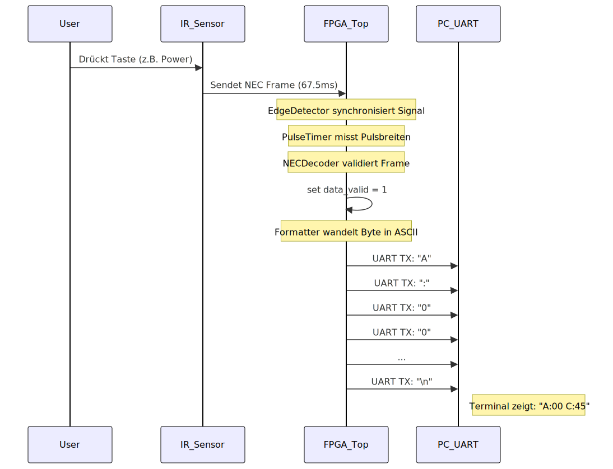

# IR Decoder Top Level (`ir_decoder_top`)

Das Modul `ir_decoder_top` ist die oberste Hierarchieebene (Top-Level-Entity) des Projekts. Es integriert alle Subkomponenten zu einem funktionalen Gesamtsystem zur Infrarot-Signalverarbeitung.

## 1. Funktionsbeschreibung

Das System empfängt ein serielles, asynchrones Infrarot-Signal (NEC-Protokoll), dekodiert die darin enthaltene Adresse und das Kommando und gibt diese Informationen als formatierten ASCII-Text über eine UART-Schnittstelle aus. Zusätzlich wird der interne Status über LEDs visualisiert.

**Hauptmerkmale:**
*   **Volle Hardware-Implementierung:** Keine CPU/Software notwendig.
*   **Echtzeit-Dekodierung:** Verarbeitung erfolgt direkt während des Empfangs.
*   **Fehlererkennung:** Überprüfung der NEC-Checksumme (Address + ~Address, Command + ~Command).
*   **Glitch-Filter:** Der Eingang `ir_in_PAD` wird synchronisiert und entprellt.

## 2. Architektur & Datenfluss

Das folgende Diagramm zeigt den internen Aufbau und den Signalpfad durch die Instanzen:



### Detaillierter Datenpfad

1.  **Signalaufbereitung (`EdgeDetector`):**
    *   Das Signal vom IR-Sensor (oft Active-Low) ist asynchron und kann Glitches enthalten.
    *   Der Flankendetektor synchronisiert das Signal mit dem Systemtakt (`clk`) und filtert kurze Störimpulse.
    *   Erzeugt stabile `enable`-Pulse für steigende und fallende Flanken.

2.  **Zeitmessung (`PulseTimer`):**
    *   Ein Zähler misst die Zeitdifferenz zwischen zwei Flanken.
    *   Unterscheidet zwischen langen Pausen (Timeout) und gültigen Pulsen.
    *   Gibt die Breite (`pulse_width`) und den Pegel (`pulse_level`) des letzten Pulses aus.

3.  **Protokoll-Logik (`NECDecoder`):**
    *   Eine Zustandsmaschine (FSM) analysiert die Pulssequenzen.
    *   Erkennt den **Start-Burst** (9ms Low, 4.5ms High).
    *   Unterscheidet **Logisch 0** (560µs Low, 560µs High) und **Logisch 1** (560µs Low, 1.69ms High).
    *   Schiebt die Bits in ein Schieberegister und prüft am Ende die Parität.
    *   Gibt bei Erfolg `data_valid` sowie `address` und `command` aus.

4.  **Ausgabe-Formatierung (`OutputFormatter`):**
    *   Wartet auf `data_valid` vom Decoder.
    *   Wandelt die 8-Bit Werte in Hex-ASCII-Zeichen um (Nibble-weise).
    *   Steuert den UART-Sender über ein Handshake-Protokoll (`uart_req`, `uart_ready`).
    *   Format: `A:<AddressHex> C:<CommandHex>\n`.

5.  **Serielle Übertragung (`UART_TX`):**
    *   Serialisiert die 8-Bit ASCII-Zeichen gemäß RS-232 Standard (Startbit, 8 Datenbits, Stopbit).
    *   Arbeitet standardmäßig mit **9600 Baud** (konfigurierbar).

## 3. Ablauf-Diagramm

Der folgende Sequenz-Graph verdeutlicht den zeitlichen Ablauf von der Benutzereingabe bis zur Terminal-Ausgabe:



## 4. Zustands-Diagramm (High-Level)

Das System durchläuft folgende Hauptphasen:



## 5. Schnittstellen-Beschreibung (Ports)

| Signal Name | Richtung | Breite | Typ | Beschreibung |
| :--- | :--- | :--- | :--- | :--- |
| **System** | | | | |
| `clk_PAD` | Input | 1 | `logic` | **Systemtakt.** Standard: 10 MHz. Alle internen Logik-Operationen sind synchron zu diesem Takt. |
| `rst_n_PAD` | Input | 1 | `logic` | **Asynchroner Reset.** Active-Low. Ein Low-Pegel setzt alle internen Register und State Machines zurück. |
| **Eingänge** | | | | |
| `ir_in_PAD` | Input | 1 | `logic` | **IR-Sensor Eingang.** Verbunden mit dem Datenausgang eines 38kHz IR-Empfängers (z.B. TSOP4838). <br>Ruhezustand: High (1). <br>Aktiv: Low (0). |
| **Ausgänge** | | | | |
| `uart_tx_PAD` | Output | 1 | `logic` | **UART Transmit.** Serielle Datenleitung zum PC/Host. <br>Ruhezustand: High (1). <br>Protokoll: 8N1. |
| **Status LEDs** | | | | |
| `led_valid_PAD` | Output | 1 | `logic` | **Erfolg:** Leuchtet für einen Taktzyklus auf, wenn ein NEC-Frame erfolgreich dekodiert und die Checksumme validiert wurde. |
| `led_error_PAD` | Output | 1 | `logic` | **Fehler:** Leuchtet auf, wenn ein Frame empfangen wurde, aber die Checksumme falsch war oder das Protokoll verletzt wurde. |
| `led_active_PAD`| Output | 1 | `logic` | **Aktivität:** Leuchtet dauerhaft, solange der Decoder ein laufendes Frame (Start-Bit bis Stop-Bit) erkennt. Nützlich zur Diagnose von Empfangsproblemen. |

## 5. Konfiguration (Parameter)

Das Modul ist über Parameter konfigurierbar, um es an verschiedene Taktfrequenzen anzupassen. Die Timings für das NEC-Protokoll werden intern automatisch basierend auf `CLK_FREQ` berechnet.

| Parameter | Typ | Default | Beschreibung |
| :--- | :--- | :--- | :--- |
| `CLK_FREQ` | `int` | `10_000_000` | Systemtaktfrequenz in Hz. Muss exakt mit dem angelegten Takt übereinstimmen, da sonst die Zeitmessung (PulseTimer) und die Baudrate falsch sind. |
| `BAUD_RATE` | `int` | `9600` | Gewünschte Baudrate für die UART-Ausgabe. |

## 6. Integration & Nutzung

### Instanziierung in SystemVerilog

```systemverilog
ir_decoder_top #(
    .CLK_FREQ(50_000_000),  // Beispiel: 50 MHz Takt
    .BAUD_RATE(115200)      // Beispiel: 115200 Baud
) my_decoder (
    .clk_PAD(sys_clk),
    .rst_n_PAD(sys_rst_n),
    .ir_in_PAD(ir_sensor_pin),
    .uart_tx_PAD(rx_pin_to_pc),
    .led_valid_PAD(led[0]),
    .led_error_PAD(led[1]),
    .led_active_PAD(led[2])
);
```

## 7. Simulation

Die Verifikation erfolgt mittels **CocoTB** (Python).

*   **Pfad:** `TopLevel/test/test_ir_decoder_integration.py`
*   **Runner:** `pytest`

Der Test `test_full_nec_to_uart` simuliert die physikalische Ebene:
1.  Er generiert Timings im Mikrosekundenbereich für `ir_in_PAD` (High/Low Wechsel).
2.  Er überwacht `uart_tx_PAD` und tastet die seriellen Bits ab.
3.  Er vergleicht das gesendete IR-Kommando mit dem empfangenen UART-String.

Ausführen:
```bash
pytest TopLevel/test/test_ir_decoder_integration.py
```
