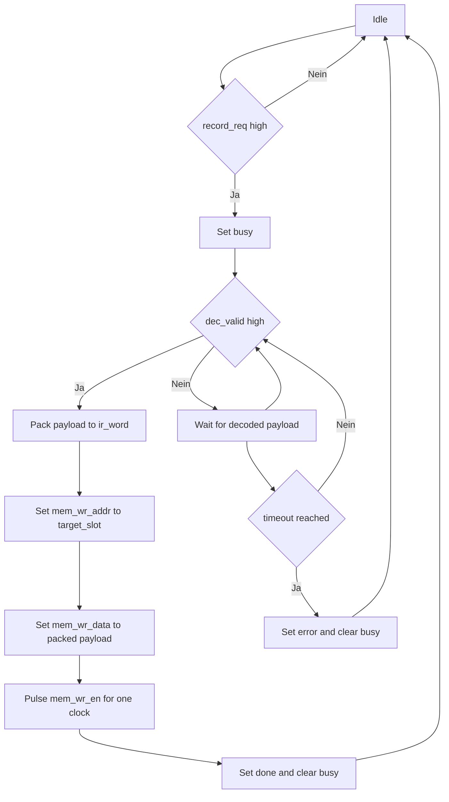
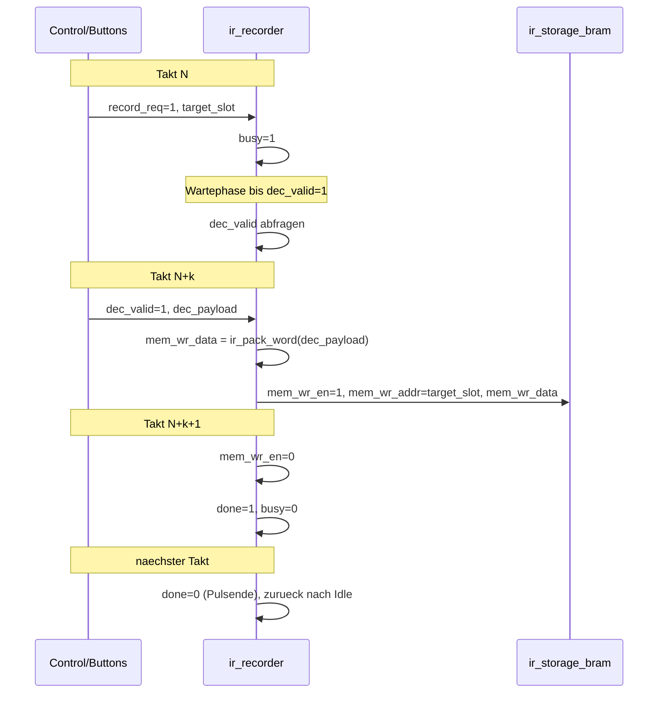

# Recorder (`ir_recorder`)

## Was macht dieses Modul?
`ir_recorder` nimmt bereits dekodierte IR-Daten (`dec_payload`) an und schreibt sie in den Speicher (`ir_storage_bram`).

Kurz gesagt:
- wartet auf einen Record-Request (`record_req`),
- uebernimmt bei gueltigen Decoder-Daten (`dec_valid`) den Payload,
- packt den Payload zu einem 67-Bit-Wort (`ir_pack_word(dec_payload)`), das `frame_data`, `frame_bits`, `protocol_id` und `flags` enthält,
- schreibt das Wort in den Zielslot (`target_slot`) ueber `mem_wr_*`.

Statussignale:
- `busy`: Recorder ist aktiv.
- `done`: Aufnahme/Write wurde erfolgreich abgeschlossen.
- `error`: Fehlerfall (z. B. Request ohne gueltige Daten innerhalb eines Timeouts).

MVP-Hinweis:
- Der REC-Button treibt `record_req`.
- `target_slot` ist im MVP typischerweise fest `0`.

## Ablaufdiagramm (funktional)

## Zeitlicher Ablauf (vereinfacht)

Hinweis:
- Aktuelle Implementierung: `done` und `error` sind 1-Takt-Pulse.
- Aktuelle Timeout-Definition: `WAIT_TIMEOUT_CYCLES = 256` (Parameter in `ir_recorder.sv`).
