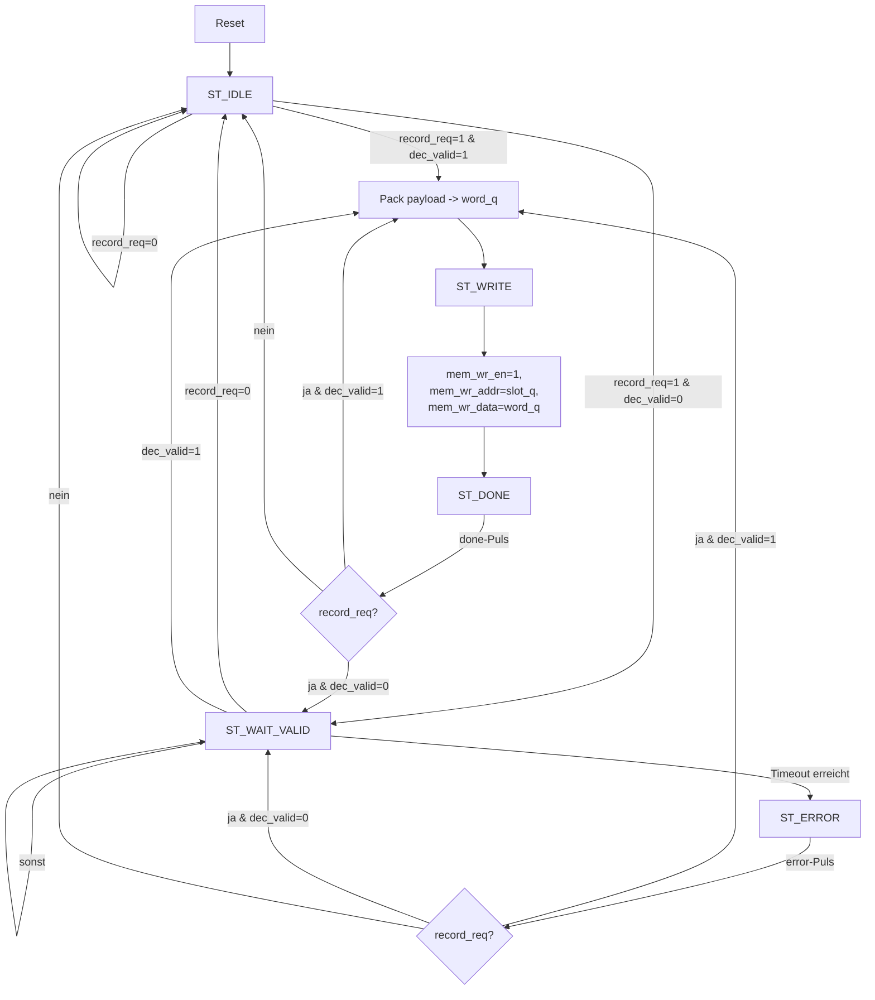

# Ablaufdiagramm `ir_recorder`

```mermaid
flowchart TD
  A[Reset] --> B[ST_IDLE]

  B -->|record_req=0| B
  B -->|record_req=1 & dec_valid=1| C[Pack payload -> word_q]
  B -->|record_req=1 & dec_valid=0| D[ST_WAIT_VALID]

  C --> E[ST_WRITE]

  D -->|record_req=0| B
  D -->|dec_valid=1| C
  D -->|Timeout erreicht| F[ST_ERROR]
  D -->|sonst| D

  E --> G[mem_wr_en=1,\nmem_wr_addr=slot_q,\nmem_wr_data=word_q]
  G --> H[ST_DONE]

  H -->|done-Puls| I{record_req?}
  I -->|ja & dec_valid=1| C
  I -->|ja & dec_valid=0| D
  I -->|nein| B

  F -->|error-Puls| J{record_req?}
  J -->|ja & dec_valid=1| C
  J -->|ja & dec_valid=0| D
  J -->|nein| B
```
