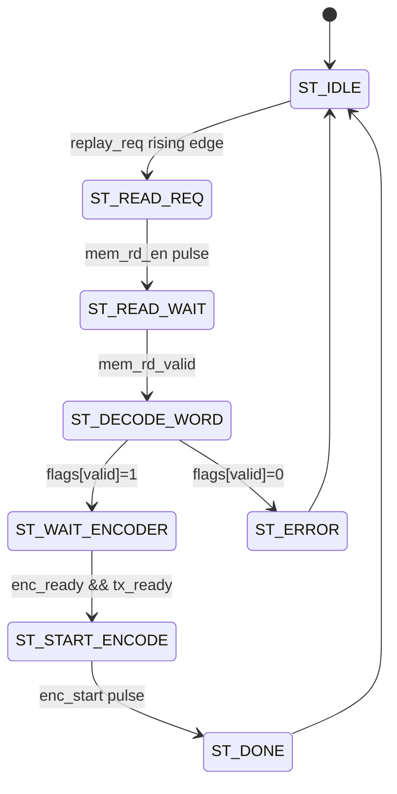

# Replay FSM

Die `ir_replay_fsm` steuert den Replay-Ablauf: Sie liest einen Slot aus dem Speicher, entpackt das 32-Bit-Wort zu `address/command/flags` und startet den Encoder nur dann, wenn `enc_ready` und `tx_ready` aktiv sind.

## Kurzablauf

1. `replay_req` (Rising Edge) startet den Ablauf und uebernimmt `target_slot`.
2. `mem_rd_en` wird fuer einen Takt gepulst, um den Slot zu lesen.
3. Bei `mem_rd_valid` wird das Wort uebernommen und entpackt.
4. Wenn `flags[IR_FLAG_VALID_BIT] = 1`, wartet die FSM auf `enc_ready && tx_ready`.
5. `enc_start` wird fuer einen Takt gepulst, `enc_payload` ist das entpackte Wort.
6. Danach folgt ein `done`-Puls; bei ungueltigem Slot ein `error`-Puls.

## State Machine

