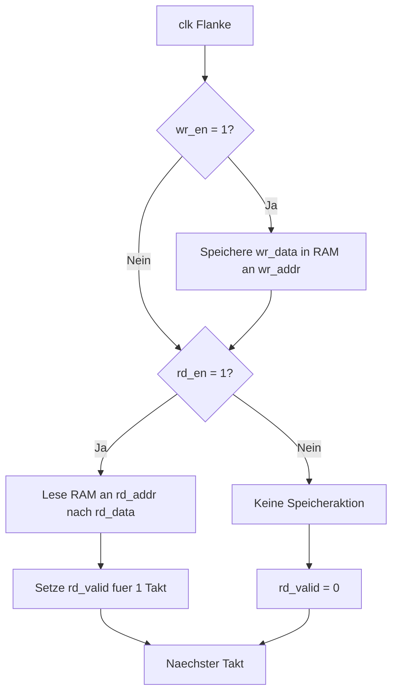
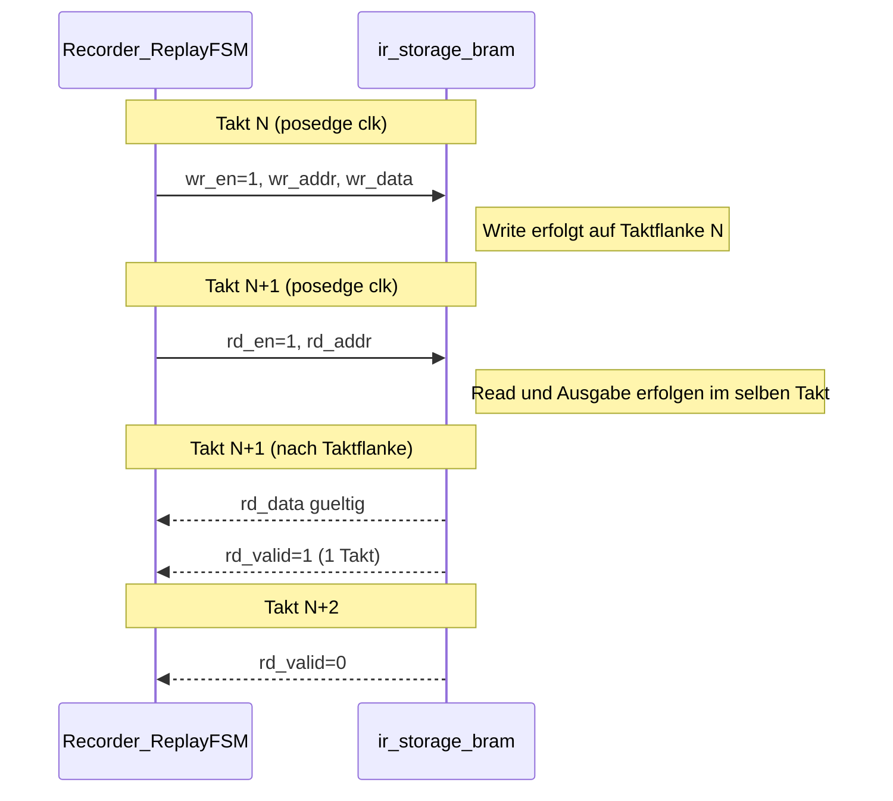

# Ablaufdiagramm: `ir_storage_bram`

## Was macht `ir_storage_bram`?
`ir_storage_bram` ist der interne Speicherblock fuer aufgezeichnete IR-Codes.
Er speichert pro Slot ein 32-Bit-Wort (`ir_word_t`) und trennt sauber zwischen:

- **Schreiben (Record-Pfad)**: `wr_en`, `wr_addr`, `wr_data`
- **Lesen (Replay-Pfad)**: `rd_en`, `rd_addr` -> `rd_data`, `rd_valid`

Das Modul ist als BRAM-Inferenz gedacht (FPGA Block RAM), damit die Daten effizient und stabil gespeichert werden.

## Ablaufdiagramm (Write + Read)


## Signale kurz erklaert
- `wr_en`: Schreibfreigabe.
- `wr_addr`: Zielslot fuer den Write.
- `wr_data`: 32-Bit IR-Wort, das gespeichert wird.
- `rd_en`: Lesefreigabe.
- `rd_addr`: Quellslot fuer den Read.
- `rd_data`: Ausgelesenes 32-Bit IR-Wort.
- `rd_valid`: Zeigt an, dass `rd_data` gueltig ist (typisch 1 Takt).

## Warum ist das wichtig im Recorder/Replay-System?
- Beim **Aufzeichnen** schreibt der Recorder den dekodierten NEC-Code in einen Slot.
- Beim **Abspielen** liest die Replay-FSM denselben Slot wieder aus.
- So kann ein empfangener Code spaeter reproduzierbar erneut gesendet werden.

## Praktischer Hinweis fuer deine Implementierung
Wenn du das RTL fertig machst, setze den Speicher als Array mit BRAM-Hinweis um, z. B.:

```systemverilog
(* ram_style = "block" *) ir_word_t mem [0:SLOT_COUNT-1];
```

Damit inferiert der Synthesizer den Speicher als Block RAM statt als reine FF-Struktur.

## Zeitlicher Ablauf (Timing, vereinfacht)


Hinweis:
- Exakte Latenz kann je nach RTL-Implementierung variieren.
- Fuer dieses Projekt ist das Ziel: `rd_valid` pulst genau dann, wenn `rd_data` stabil/gueltig ist.
