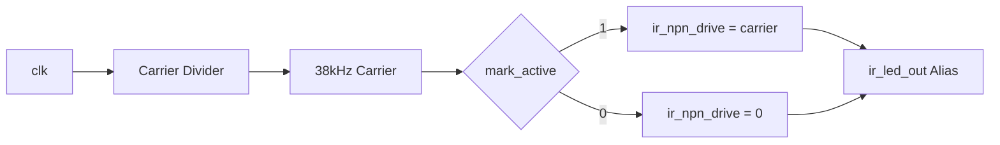

# IR TX (`ir_tx`)

Der `ir_tx` erzeugt den 38-kHz-Traeger und moduliert ihn mit `mark_active`.

## Verhalten

- `mark_active = 1`: Traeger wird auf `ir_npn_drive` ausgegeben
- `mark_active = 0`: Ausgang ist Idle-Low (`0`)
- `ir_led_out` ist ein Kompatibilitaets-Alias von `ir_npn_drive`
- `ready` ist fuer die einfache TX-Stufe immer `1`

## Schnittstelle

- Eingang:
- `clk`, `rst_n`, `mark_active`
- Ausgaenge:
- `ir_npn_drive`, `ir_led_out`, `ready`

`ir_npn_drive` ist fuer eine NPN-Transistorstufe gedacht:

`FPGA -> Basiswiderstand -> NPN-Basis`, LED am Kollektor.

## Mermaid: Datenpfad

## Tests

`test/test_ir_tx.py` prueft:

- Carrier-Toggling bei `mark_active=1`
- Idle-Low und `ready=1` bei `mark_active=0`
