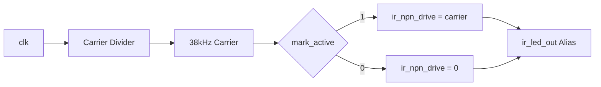

# IR TX (`ir_tx`)

The `ir_tx` module generates the 38 kHz carrier frequency and modulates it based on `mark_active`.

## Behavior

- `mark_active = 1`: The 38 kHz carrier is output on `ir_npn_drive`.
- `mark_active = 0`: Output is set to Idle-Low (`0`).
- `ir_led_out` is a compatibility alias for `ir_npn_drive`.
- `ready` is always `1` for this simple TX stage.

## Interface

- **Inputs**:
  - `clk`, `rst_n`, `mark_active`
- **Outputs**:
  - `ir_npn_drive`, `ir_led_out`, `ready`

`ir_npn_drive` is designed to drive an NPN transistor stage:

`FPGA -> Base Resistor -> NPN Base`, with the LED connected to the Collector.

## Mermaid: Datapath

## Tests

`test/test_ir_tx.py` verifies:

- Carrier toggling when `mark_active=1`
- Idle-Low state and `ready=1` when `mark_active=0`

