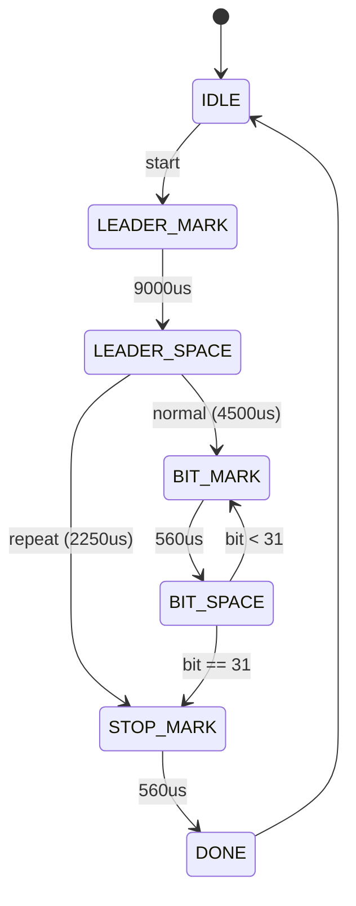

# NEC Encoder (`nec_encoder`)

Der `nec_encoder` erzeugt aus einem Payload (`address`, `command`, `flags`) die NEC-Mark/Space-Sequenz.

## Verhalten

- Start über `start` (1 Takt Puls)
- Zeitbasis über `tick_us` (1 Puls pro Mikrosekunde)
- Ausgabe:
- `mark_active = 1`: IR-Burst aktiv
- `mark_active = 0`: Space
- `frame_done`: 1-Takt-Puls am Ende
- `busy`/`frame_active`: aktiv während des Frames
- Der Encoder nutzt `frame_data`, `frame_bits` und `protocol_id`, um auch Samsung32/Samsung36-Frames mit korrekter Leader-/Sync-Struktur zu reproduzieren.

## Frame-Format

- Normalframe:
- Leader Mark: `9.0 ms`
- Leader Space: `4.5 ms`
- 32 Datenbits LSB-first
- Stop Mark: `560 us`
- Repeatframe (`flags[IR_FLAG_REPEAT_BIT]=1`):
- Leader Mark: `9.0 ms`
- Space: `2.25 ms`
- Stop Mark: `560 us`

Datenwort (LSB-first gesendet):

`{~command[7:0], command[7:0], address[15:8], address[7:0]}`

## Mermaid: Zustandsautomat

## Tests

`test/test_nec_encoder.py` prueft:

- Vollstaendigen Frame mit `frame_done`
- Repeat-Flag mit verkuerztem Ablauf
