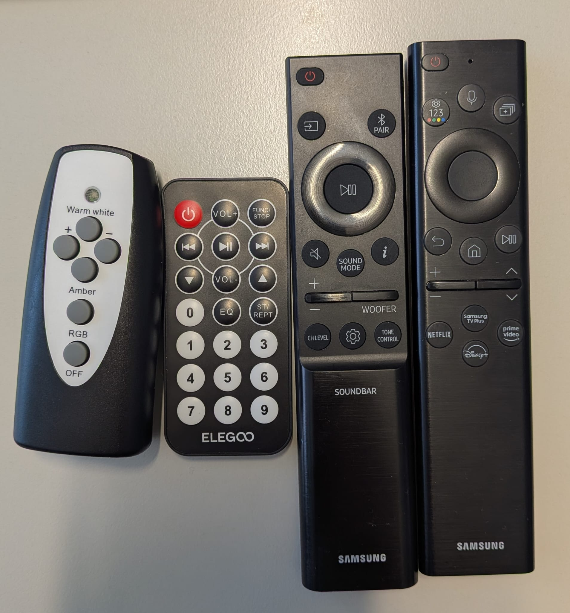

# IR Remote Decoder Project

Welcome to the **IR Remote Decoder** project!

This repository contains the complete source code for a hardware-based Infrared Receiver/Decoder and Recorder/Replay system, optimized for FPGAs (specifically strictly designed for usage with IHP SG13G2 technology, but generally usable).

## 🚀 Features

- **Full Hardware Decoding** of NEC, Samsung variants, and NEC-like N8X2 IR protocols.
- **Micro-UART** for data output to a PC.
- **Modular Design** with cleanly separated components.
- **Comprehensive Test Suite** based on Python and CocoTB.
- **IR Recording & Replay** capabilities.

## 🎛️ Supported Remotes



The decoder core supports multiple variants of the pulse-distance protocol:

1.  **NEC Standard** (e.g. standard TV remotes, Arduino kits)
    *   Carrier: 38 kHz
    *   Leader: 9ms Mark, 4.5ms Space
    *   32-bit payload (Address + Command)
2.  **Samsung32 & Samsung36**
    *   Pulse-distance protocol similar to NEC but with different leader/sync timings
    *   32-bit (Samsung32) or 36-bit (Samsung36) payload
3.  **N8X2** (Project-specific designation)
    *   A custom name for the protocol used by common cheap RGB LED remote controllers (24/44 keys)
    *   NEC-like structure but with significantly shorter bit timings (approx. 1.0 ms for '1')

## 📂 Structure

The project is modular. Each module resides in its own subdirectory with source code, tests, and documentation.

| Module | Description |
| :--- | :--- |
| [**TopLevel**](TopLevel/README.md) | **Canonical Entry Point**. The main integration module for the board. |
| [**IRDecoder**](IRDecoder/README.md) | Decoder modules (NEC Decoder, Edge Detector, etc.). |
| [**IRRecorder_Replay**](IRRecorder_Replay/README.md) | Recorder and Replay modules. |
| [**legacy**](legacy/) | Archived legacy code (e.g., old `IRDecoder/TopLevel`). |

## 🛠️ Quick Start

### Prerequisites
- Icarus Verilog (Simulator)
- Python 3
- `cocotb`, `cocotb-test`, `pytest`

### Running Tests

To ensure everything is working, you can run all tests in the repository at once:

```bash
pytest
```

This runs hundreds of tests across all modules, from simple unit tests to complex system integration tests.

## 📝 License

This project is Open Source. Feel free to fork it, improve it, and send Pull Requests!
