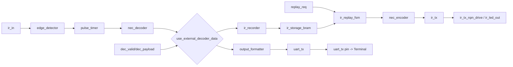

# IR Recorder Replay TopLevel (`ir_recorder_replay_top`)

This TopLevel connects IR reception (NEC/Samsung/N8X2), recording to BRAM, and replay with the IR transmitter.
Additionally, each decoded frame is output via UART for the terminal.

## New Directory Structure

The common integration TopLevel is now located at the root level:

- RTL: `TopLevel/src/ir_recorder_replay_top.sv`
- Tests: `TopLevel/test/test_ir_closed_loop.py`
- Helper: `TopLevel/test/test_helpers.py`

Used submodules remain in their domain folders:

- Decoder Chain: `IRDecoder/*`
- Recorder/Replay/Encoder/TX: `IRRecorder_Replay/*`
- UART Formatter/Transmitter: `IRDecoder/OutputFormatter/*`, `IRDecoder/UART_TX/*`

## Purpose

- Receive IR signal (`ir_in`)
- Decode NEC, Samsung variants, and N8X2
- Output decoded data as UART text (`uart_tx`)
- On button press (`record_req`), save last valid code to slot
- On button press (`replay_req`), transmit stored slot again

## Ports (Important for Usage)

- Inputs:
  - `clk`, `rst_n`
  - `ir_in`: Raw signal from IR receiver
  - `record_req`: Record button (edge)
  - `replay_req`: Replay button (edge)
  - `slot_sel[2:0]`: Target slot (0..7)
  - `use_external_decoder_data`: 1 = External decode bypass
  - `dec_valid`, `dec_payload[31:0]`: External decode stream for Test/Debug
- Outputs:
  - `ir_tx_npn_drive`, `ir_led_out`: IR transmit output
  - `uart_tx`: UART output for terminal
  - `ld7..ld0`: Status LEDs
  - `rec_done`, `rep_done`, `busy`, `error`

## Control Logic

- `record_req` is detected on edge and held internally (`record_hold_q`) until
  `rec_done` or `rec_error` occurs.
- This ensures a short button press is not lost, even if `dec_valid`
  arrives later.
- `replay_req` is passed as a pulse to the Replay FSM on edge detection.
- `rep_done` is only set when the encoder has transmitted the complete NEC frame
  (`frame_done`).

## Clock Handling (100 MHz FPGA)

The TopLevel expects a standard 100 MHz FPGA clock:

- Input Clock: `100 MHz`
- Internal Core Clock: `10 MHz`

Internally, the input clock is divided to the 10 MHz core clock (analogous to the
existing Decoder TopLevel concept). The following run on this core clock:

- `edge_detector`
- `pulse_timer`
- `nec_decoder`
- `ir_recorder`
- `ir_storage_bram`
- `ir_replay_fsm`
- `nec_encoder`
- `ir_tx`
- `output_formatter`
- `uart_tx`

Why this is important:

- The existing `nec_decoder` uses fixed timing windows designed for 10 MHz.
- `uart_tx` is also parameterized based on `CORE_CLK_HZ`
  (`CLOCKS_PER_BIT = CORE_CLK_HZ / 9600`).

Note:

- In simulation, the divider is bypassed via `SIMULATION` define and
  `clk_core` is fed directly from the testbench clock (as in the old Decoder TopLevel).

## External Decoder Bypass

For tests/debug, an external payload stream can be used instead of the internal NEC decoder:

- `use_external_decoder_data = 1`
- `dec_valid` + `dec_payload` drive

## Process: Recording (Record)

1. User presses `record_req` (short pulse is sufficient).
2. TopLevel detects the edge and sets internal `record_hold_q=1`.
3. Recording remains active as long as no valid decode frame is present.
4. On `dec_valid=1`, payload is written to the selected `slot_sel`:
   `{address[15:0], command[7:0], flags[7:0]}`.
   For the internal decoder path, `address` is stored in NEC 8-bit form:
   `{~addr, addr}`.
5. The valid bit is set (`flags[0]=1`) so Replay knows: Slot is valid.
6. `rec_done` pulses for 1 clock cycle and recording ends (`record_hold_q=0`).
7. If no valid frame arrives in time: `rec_error` pulses.
8. Timeout is set in TopLevel to approx. 3 seconds (`RECORD_TIMEOUT_CYCLES = 3 * CORE_CLK_HZ`).

## Process: Retransmit (Replay)

1. User presses `replay_req` (edge pulse).
2. `ir_replay_fsm` reads slot `slot_sel` from BRAM.
3. If `flags[0]=1` (valid), starts `nec_encoder` (`enc_start`).
4. `nec_encoder` generates the Mark/Space profile for the stored protocol (including N8X2 timing).
5. `ir_tx` modulates this profile onto 38 kHz carrier.
6. Carrier appears on `ir_tx_npn_drive` (and `ir_led_out` alias).
7. When the complete frame is done, `rep_done` pulses.

## Process: UART Output

1. Each decoded frame (internal or external bypass) goes continuously into the UART path.
2. `output_formatter` formats as text:
   `A:xx C:yy\n`
3. `uart_tx` sends the string serially via `uart_tx`.
4. This allows you to see the decoded commands in the terminal.

## Interaction of Modules

- Reception:
  - `edge_detector` synchronizes `ir_in` and generates edges.
  - `pulse_timer` measures pulse/pause lengths.
  - `nec_decoder` detects NEC protocol and generates `address/command/valid`.
- Storage:
  - `ir_recorder` receives valid frames and writes them.
  - `ir_storage_bram` stores slot data.
- Replay:
  - `ir_replay_fsm` reads slots and controls replay start.
  - `nec_encoder` converts stored data into NEC transmit profile.
  - `ir_tx` generates the 38 kHz modulated output.
- Diagnosis:
  - `output_formatter` + `uart_tx` provide terminal text.

## Status Signals

- `busy = rec_busy || rep_busy || enc_busy`
- `error = rec_error || rep_error || enc_error`
- `rec_done`: Recording successfully completed
- `rep_done`: Replay frame completely transmitted

## LED Behavior (as requested)

Fixed settings:

- `LD7`: Slow Clock/Heartbeat (like old Decoder TopLevel)
- `LD6`: IR Reception active (`nec_decoder.receiving`)
- `LD4`: Signal correctly decoded (Decode-OK)

Remaining meaningful assignment:

- `LD5`: Recording active (blinks until a valid frame is stored or timeout), Replay active (steady on), in Idle error indication (stretched pulse on `error`)
- `LD3`: Error pulse (stretched)
- `LD2`: Replay/Transmit active (Replay FSM or Encoder busy)
- `LD1`: Global busy
- `LD0`: UART Activity (stretched pulse on UART transmit request)

Note on visibility:

- Short pulses (`dec_valid`, `error`, `uart_tx_req`) are stretched internally to approx. 200 ms
  so they are visible on LEDs.

## Test

```bash
cd TopLevel/test
pytest -q test_ir_closed_loop.py
```

## Mermaid: Architecture


