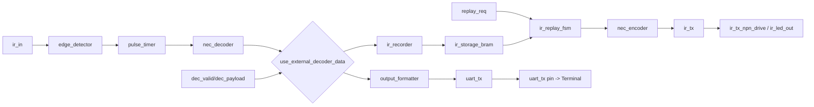

# IR Recorder Replay TopLevel (`ir_recorder_replay_top`)

Dieses TopLevel verbindet NEC-Empfang, Aufnahme in BRAM und Replay mit IR-Sender.
Zusaetzlich wird jedes dekodierte Frame per UART fuer das Terminal ausgegeben.

## Neue Ordnerstruktur

Der gemeinsame Integrations-TopLevel liegt jetzt auf Root-Ebene:

- RTL: `TopLevel/src/ir_recorder_replay_top.sv`
- Tests: `TopLevel/test/test_ir_closed_loop.py`
- Helper: `TopLevel/test/test_helpers.py`

Verwendete Submodule bleiben in ihren Domänenordnern:

- Decoder-Kette: `IRDecoder/*`
- Recorder/Replay/Encoder/TX: `IRRecorder_Replay/*`
- UART-Formatter/Sender: `IRDecoder/OutputFormatter/*`, `IRDecoder/UART_TX/*`

## Zweck

- IR-Signal empfangen (`ir_in`)
- NEC dekodieren
- Dekodierte Daten als UART-Text ausgeben (`uart_tx`)
- Auf Knopfdruck (`record_req`) letzten gueltigen Code in Slot speichern
- Auf Knopfdruck (`replay_req`) gespeicherten Slot wieder senden

## Ports (wichtig fuer Nutzung)

- Eingänge:
- `clk`, `rst_n`
- `ir_in`: Rohsignal vom IR-Empfänger
- `record_req`: Aufnahme-Taster (Flanke)
- `replay_req`: Replay-Taster (Flanke)
- `slot_sel[2:0]`: Zielslot (0..7)
- `use_external_decoder_data`: 1 = externer Decode-Bypass
- `dec_valid`, `dec_payload[31:0]`: externer Decode-Stream fuer Test/Debug
- Ausgänge:
- `ir_tx_npn_drive`, `ir_led_out`: IR-Sendeausgang
- `uart_tx`: UART-Ausgabe fuer Terminal
- `ld7..ld0`: Status-LEDs
- `rec_done`, `rep_done`, `busy`, `error`

## Steuerlogik

- `record_req` wird auf Flanke erkannt und intern gehalten (`record_hold_q`), bis
  `rec_done` oder `rec_error` kommt.
- Dadurch geht ein kurzer Tasterpuls nicht verloren, auch wenn `dec_valid`
  erst spaeter kommt.
- `replay_req` wird auf Flanke als Puls an die Replay-FSM weitergegeben.
- `rep_done` wird erst gesetzt, wenn der Encoder das komplette NEC-Frame
  gesendet hat (`frame_done`).

## Clock-Handling (100 MHz FPGA)

Der TopLevel erwartet standardmaessig einen 100-MHz-FPGA-Takt:

- Input-Clock: `100 MHz`
- interner Core-Clock: `10 MHz`

Intern wird der Input-Clock auf den 10-MHz-Core-Clock geteilt (analog zum
bestehenden Decoder-TopLevel-Konzept). Auf diesem Core-Clock laufen:

- `edge_detector`
- `pulse_timer`
- `nec_decoder`
- `ir_recorder`
- `ir_storage_bram`
- `ir_replay_fsm`
- `nec_encoder`
- `ir_tx`
- `output_formatter`
- `uart_tx`

Warum das wichtig ist:

- Der vorhandene `nec_decoder` verwendet feste Timingfenster, die fuer 10 MHz
  ausgelegt sind.
- `uart_tx` wird ebenfalls auf Basis von `CORE_CLK_HZ` parametrisiert
  (`CLOCKS_PER_BIT = CORE_CLK_HZ / 9600`).

Hinweis:

- In Simulation wird der Teiler per `SIMULATION`-Define umgangen und
  `clk_core` direkt aus dem Testbench-Clock gespeist (wie im alten Decoder-TopLevel).

## Externer Decoder-Bypass

Fuer Tests/Debug kann statt des internen NEC-Decoders ein externer
Payload-Stream genutzt werden:

- `use_external_decoder_data = 1`
- `dec_valid` + `dec_payload` treiben

## Ablauf: Aufnahme (Record)

1. Nutzer drückt `record_req` (kurzer Puls reicht).
2. TopLevel erkennt die Flanke und setzt intern `record_hold_q=1`.
3. Solange kein gültiges Decode-Frame vorliegt, bleibt die Aufnahme aktiv.
4. Bei `dec_valid=1` wird Payload in den gewählten `slot_sel` geschrieben:
`{address[15:0], command[7:0], flags[7:0]}`.
5. Das Valid-Bit wird gesetzt (`flags[0]=1`), damit Replay weiß: Slot ist gültig.
6. `rec_done` pulst 1 Takt und die Aufnahme endet (`record_hold_q=0`).
7. Falls kein gültiges Frame rechtzeitig kommt: `rec_error` pulst.
8. Timeout ist im TopLevel auf ca. 3 Sekunden gesetzt (`RECORD_TIMEOUT_CYCLES = 3 * CORE_CLK_HZ`).

## Ablauf: Erneut senden (Replay)

1. Nutzer drückt `replay_req` (Flankenpuls).
2. `ir_replay_fsm` liest den Slot `slot_sel` aus BRAM.
3. Wenn `flags[0]=1` (gültig), startet sie den `nec_encoder` (`enc_start`).
4. `nec_encoder` erzeugt das NEC-Mark/Space-Profil.
5. `ir_tx` moduliert dieses Profil auf 38 kHz Träger.
6. Der Träger erscheint auf `ir_tx_npn_drive` (und `ir_led_out` Alias).
7. Wenn das komplette Frame fertig ist, pulst `rep_done`.

## Ablauf: UART-Ausgabe

1. Jedes dekodierte Frame (intern oder externer Bypass) geht parallel in den UART-Zweig.
2. `output_formatter` formatiert als Text:
`A:xx C:yy\n`
3. `uart_tx` sendet den String seriell über `uart_tx`.
4. Damit siehst du im Terminal weiterhin die dekodierten Befehle.

## Zusammenspiel der Module

- Empfang:
- `edge_detector` synchronisiert `ir_in` und erzeugt Flanken.
- `pulse_timer` misst Puls-/Pause-Längen.
- `nec_decoder` erkennt NEC-Protokoll und erzeugt `address/command/valid`.
- Speicherung:
- `ir_recorder` nimmt gültige Frames entgegen und schreibt sie.
- `ir_storage_bram` speichert Slot-Daten.
- Replay:
- `ir_replay_fsm` liest Slots und steuert den Replay-Start.
- `nec_encoder` wandelt gespeicherte Daten in NEC-Sendeprofil um.
- `ir_tx` erzeugt den 38-kHz-modulierten Ausgang.
- Diagnose:
- `output_formatter` + `uart_tx` liefern den Terminal-Text.

## Statussignale

- `busy = rec_busy || rep_busy || enc_busy`
- `error = rec_error || rep_error || enc_error`
- `rec_done`: Aufnahme erfolgreich abgeschlossen
- `rep_done`: Replay-Frame vollständig ausgesendet

## LED-Verhalten (wie gewuenscht)

Fixe Vorgaben:

- `LD7`: langsame Clock/Heartbeat (wie alter Decoder-TopLevel)
- `LD6`: IR-Empfang aktiv (`nec_decoder.receiving`)
- `LD4`: Signal korrekt dekodiert (Decode-OK)

Restliche sinnvolle Belegung:

- `LD5`: Aufnahme aktiv (blinkt, bis ein gueltiges Frame gespeichert wurde oder Timeout), Replay aktiv (dauerhaft an), im Idle Fehleranzeige (gestretchter Puls bei `error`)
- `LD3`: Fehlerpuls (gestreckt)
- `LD2`: Replay/Senden aktiv (Replay-FSM oder Encoder busy)
- `LD1`: Gesamt-busy
- `LD0`: UART-Aktivitaet (gestretchter Puls bei UART-Sendeanforderung)

Hinweis zu Sichtbarkeit:

- Kurzpulse (`dec_valid`, `error`, `uart_tx_req`) werden intern auf ca. 200 ms
  gestreckt, damit sie auf LEDs sichtbar sind.

## Test

```bash
cd TopLevel/test
pytest -q test_ir_closed_loop.py
```

## Mermaid: Architektur


